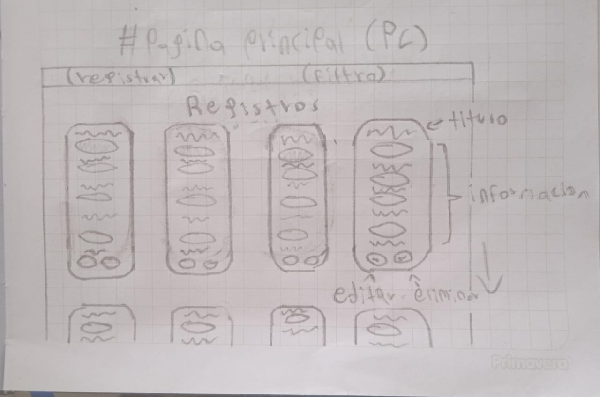
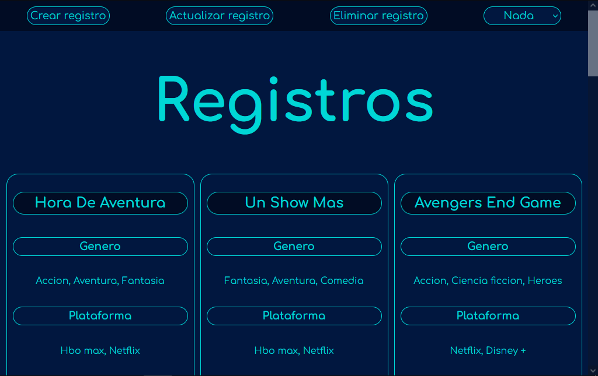
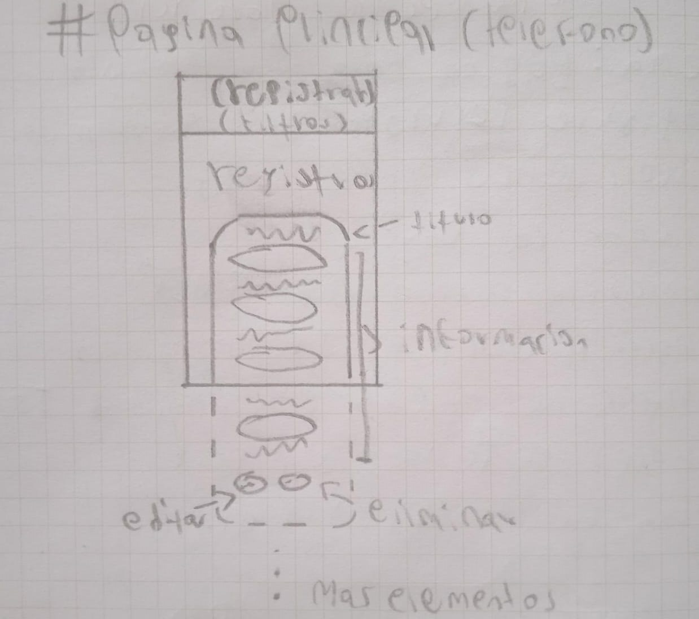
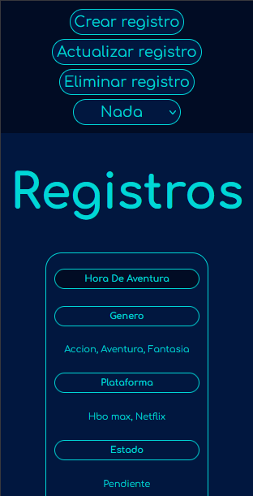
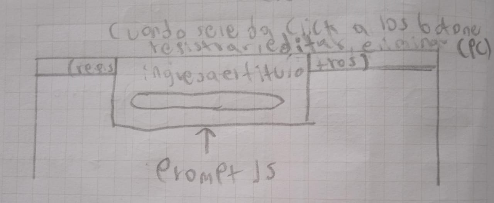
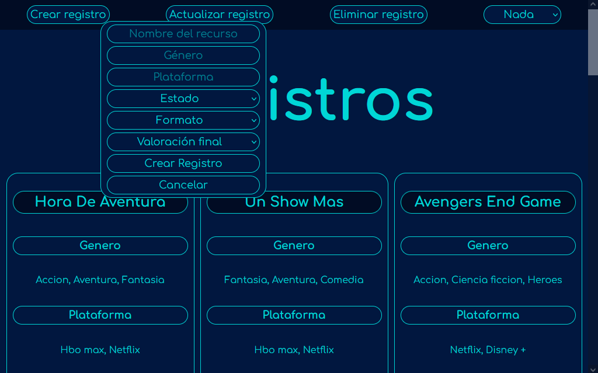
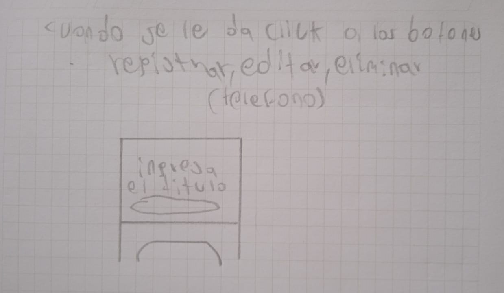
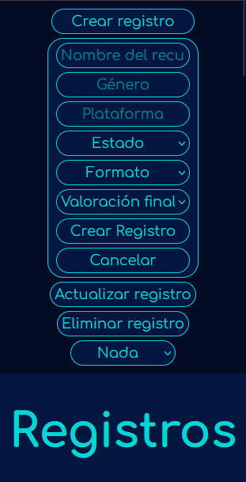

# Proyecto de JavaScript 🚀
## Tabla de contenidos 📚
- [Descripcion](#descripcion)
- [Proceso](#proceso)
- [Caracteristicas](#caracteristicas)
- [Tecnologias](#tecnologias)
- [Instalacion](#instalacion)
- [Screenshots](#screenshots)
- [Uso](#uso)
- [Autor](#autor)
- [Contacto](#contacto)
<h3 id="descripcion">Descripcion 📖</h3>

El proyecto trata sobre una pagina en donde puedes registrar informacion como el progreso de una serie, si ya termino un libro o si esta pendiente por ver una pelicula.
<h3 id="proceso">Proceso 📋</h3>

El proceso para hacer el proyecto fue:
1. Se diseño la pagina principal (HTML), haciendolo semanticamente correcto.
2. Se empezo a poner los estilos de la pagina (CSS).
3. Se agrego la logica a la pagina (JavaScript), y las funcionalidades agregar, eliminar, editar y filtros.
4. Se hizo el responsive de la pagina (CSS).
5. Se agrego la persistencia de la informacion de la pagina con JavaScript.
<h3 id="caracteristicas">Caracteristicas 💡</h3>

El proyecto fue hecho con HTML para la estructuracion, CSS para el diseño y el responsive de la pagina y JavaScript para la logica, las funcionalidades y la persistencia de la pagina.
<h3 id="tecnologias">Tecnologias 💻</h3>

- HTML: para la estructuracion.
- CSS: para el diseño y responsive de la pagina.
- JavaScript: para la logica de la pagina, funcionalidad y persistencia de la informacion.
<h3 id="instalacion">Instalacion 💾</h3>

Clonar repositorio:
```sh
https://github.com/JavierEAcevedoN/Proyecto_JavaScript_AcevedoJavier.git
```
<h3 id="screenshots">Screenshots 📷</h3>

  
El wireframe de la pagina principal en pc.  
  
Resultado final en pc.  
  
El wireframe de la pagina principal en telefono.  
  
Resultado final en telefono.
***
  
El wireframe de la pagina principal cuando se clickea los botones registrar, editar y eliminar en pc.  
  
Resultado final en pc.  
  
El wireframe de la pagina principal cuando se clickea los botones registrar, editar y eliminar en telefono.  
  
Resultado final en telefono. 
<h3 id="uso">Uso ✋</h3>

Ejecutar el index.html con Live Server o descargar el zip descomprimirlo y ejecutar el index.html.
<h3 id="autor">Autor 👤</h3>

- [JavierEAcevedoN](https://github.com/JavierEAcevedoN)
<h3 id="contacto">Contacto 📱</h3>

- Linkedin: [Javier Eduardo Acevedo Noguera](https://www.linkedin.com/in/javier-eduardo-acevedo-noguera)